# Analysis of contaminant transport in an aquifer

[MADS](http://madsjulia.github.io/Mads.jl is analyze groundwater contaminant transport.

The analyses below are performed using [`examples/contamination/contamination.jl`](https://github.com/madsjulia/Mads.jl/blob/master/examples/contamination/contamination.jl).

See also the related [Jupyter notebook](https://github.com/madsjulia/Mads.jl/blob/master/notebooks/contamination/contamination.ipynb).

## Model setup

There are 20 monitoring wells.
Each well has 2 measurement ports: shallow (3 m below the water table labeled `a`) and deep (33 m below the water table labeled `b`).
Contaminant concentrations are observed for 50 years at each well.
The contaminant transport is solved using the `Anasol` package in Mads.

## Unknown model parameters

* Start time of contaminant release $t_0$
* End time of contaminant release $t_1$
* Advective pore velocity $v$

## Reduced model setup

Analysis of the data from only 2 monitoring locations: `w13a` and `w20a`.

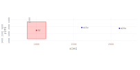

## Example model solution

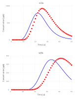

Model parameter values:

* $t_0 = 4$
* $t_1 = 15$
* $v = 40$

## Model calibration

A calibration match between observations and model predictions obtained by model inversion:

## Prior parameter uncertainties

Probabilistic distributions of the prior parameter uncertainties are:

* $t_0$ = Uniform(0, 10)
* $t_1$ = Uniform(5, 40)
* $v$ = LogUniform(0.1, 200)

Spaghetti plots representing the prior uncertainties (note that the uncertainties are not constrained by the observed data):

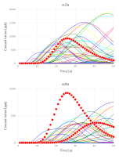

The observation data are plotted as red dots.

## Bayesian global sensitivity analysis

Histograms and scatter plots of the Bayesian MCMC results:

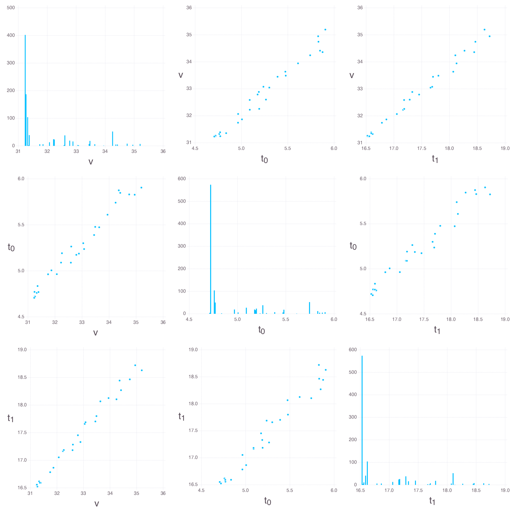

## Posterior parameter uncertainties

Spaghetti plots representing the posterior uncertainties:

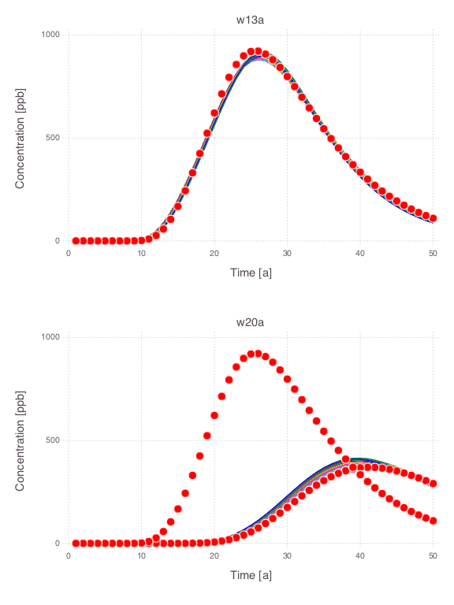

Note that the parameter uncertainties are constrained by the observation data.
The observation data are plotted as red dots.

## eFAST global sensitivity analysis

eFAST has proven to be one of the most reliable methods among the existing variance-based techniques for quantification of parameter sensitivity (Saltelli, 2004; Saltelli & Bolado, 1998; Saltelli et al., 2000; Saltelli et al., 1999).

Total and main sensitivity indices over time for monitoring wells w13a and w20a:

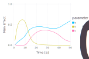
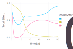
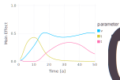
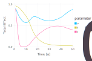

The differences between main and total effect estimates suggest correlations among the parameters.

## Saltelli's global sensitivity analysis

Classical Saltelli's (Sobol's) global sensitivity analysis.

Total and main sensitivity indices over time for monitoring wells w13a and w20a:

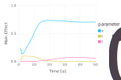
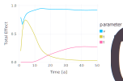
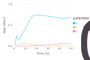
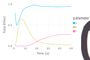

There are differences between eFAST & Saltelli estimates. The eFAST results should be considered more reliable.