# Examples

## Information Gap Analysis

All the figures below are generated using [`examples/model_analysis/infogap.jl`](https://github.com/madsjulia/Mads.jl/blob/master/examples/model_analysis/infogap.jl).

### Setup

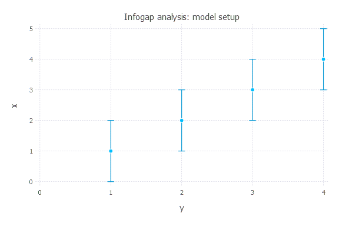

* There are 4 uncertain observations at times t = [1, 2, 3, 4]

* There are 4 possible models that can be applied to match the data
  1. `y(t) = a * t + c`
  2. `y(t) = a * t^(1.1) + b * t + c`
  3. `y(t) = a * t^n + b * t + c`
  4. `y(t) = a * exp(t * n) + b * t + c`

* There are 4 unknown model parameters with uniform prior probability functions:
  1. `a = Uniform(-10, 10)`
  2. `b = Uniform(-10, 10)`
  3. `c = Uniform(-5, 5)`
  4. `n = Uniform(-3, 3)`

* The model prediction for t = 5 is unknown and information gap prediction uncertainty needs to be evaluated

* The horizon of information gap uncertainty `h` is applied to define the acceptable deviations in the 4 uncertain observations.

* Below we explore infogap of each model for different `h` values.

### Infogap in model `y(t) = a * t + c`

* `h = 0.001`

* `h = 0.01`

* `h = 0.02`

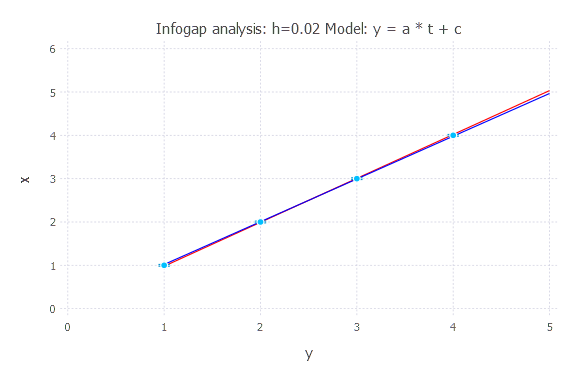

* `h = 0.05`

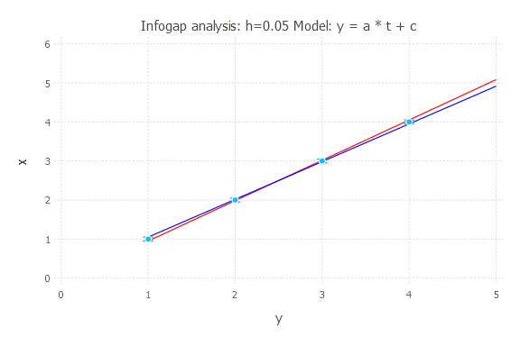

* `h = 0.1`

* `h = 0.2`

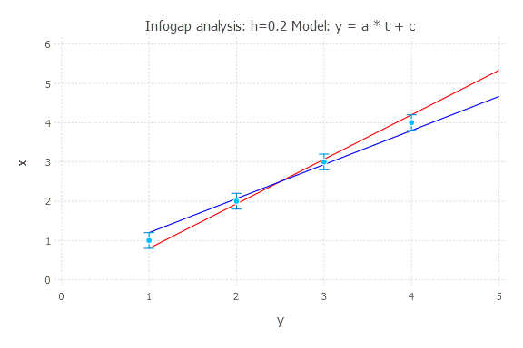

* `h = 0.5`

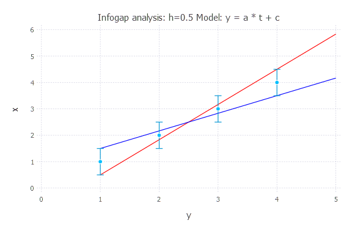

* `h = 1.0`

### Infogap in model `y(t) = a * t^(1.1) + b * t + c`

* `h = 0.001`

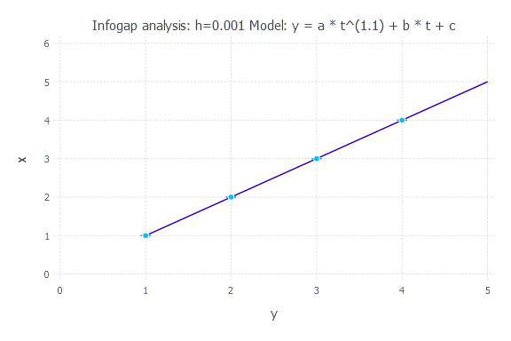

* `h = 0.01`

* `h = 0.02`

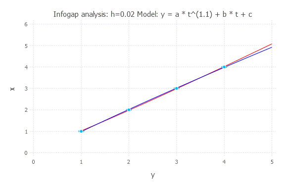

* `h = 0.05`

* `h = 0.1`

* `h = 0.2`

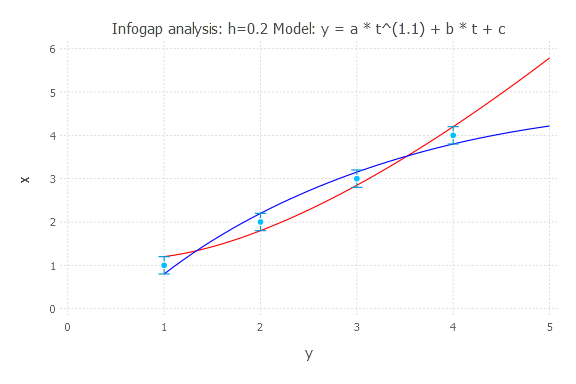

* `h = 0.5`

* `h = 1.0`

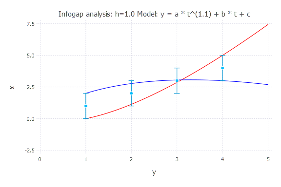

### Infogap in model `y(t) = a * t^n + b * t + c`

* `h = 0.001`

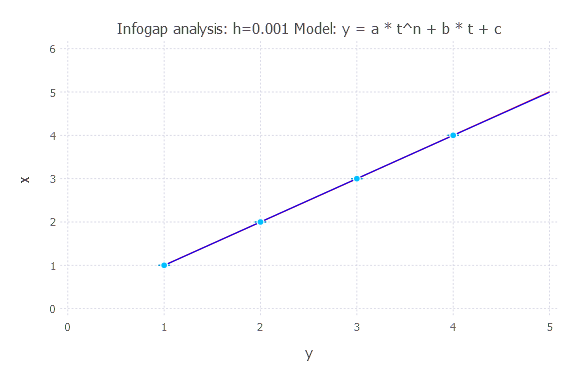

* `h = 0.01`

* `h = 0.02`

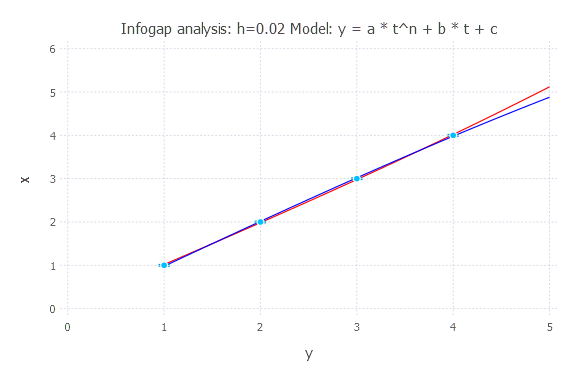

* `h = 0.05`

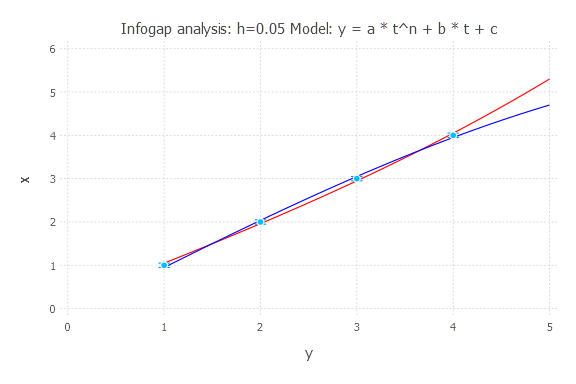

* `h = 0.1`

* `h = 0.2`

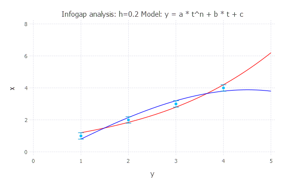

* `h = 0.5`

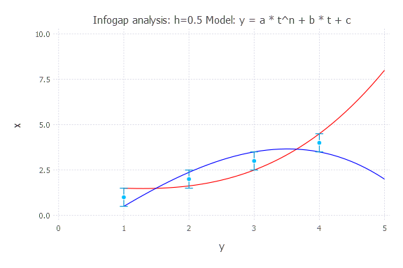

* `h = 1.0`

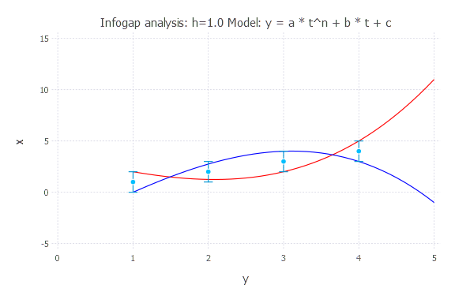

### Infogap in model `y(t) = a * exp(t * n) + b * t + c`

* `h = 0.001`

* `h = 0.01`

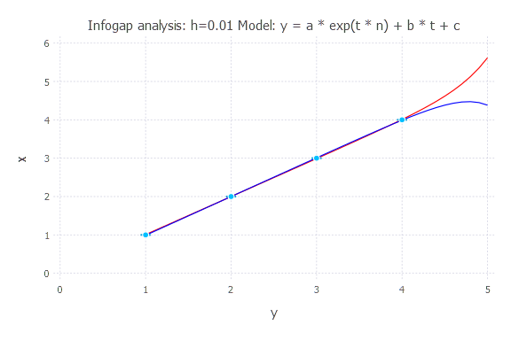

* `h = 0.02`

* `h = 0.05`

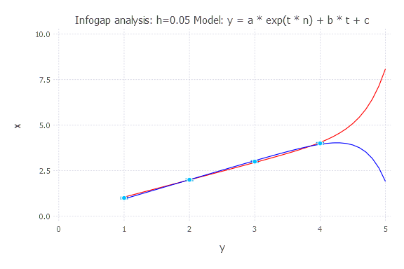

* `h = 0.1`

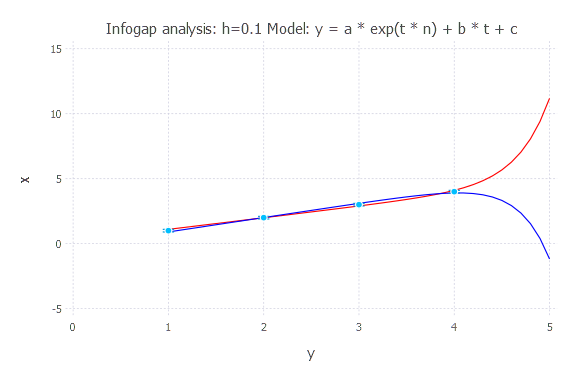

* `h = 0.2`

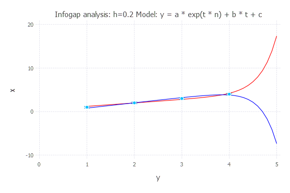

* `h = 0.5`

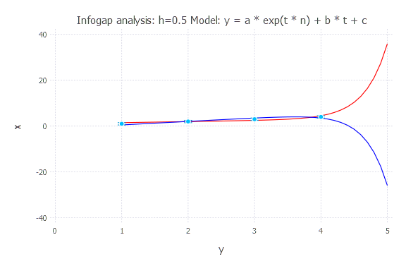

* `h = 1.0`

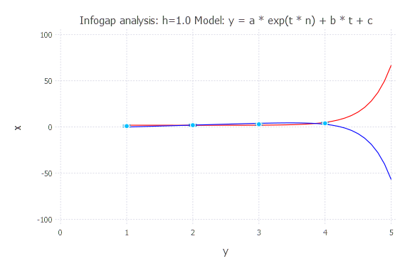

### Opportuneness and Robustness of the 4 models

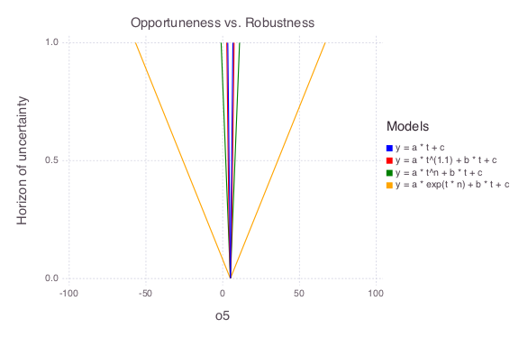

Based on the figures above, the last model (`y(t) = a * exp(t * n) + b * t + c`) is associated with the largest infogap uncertainties.

It has the lowest robustness and highest opportuneness.
