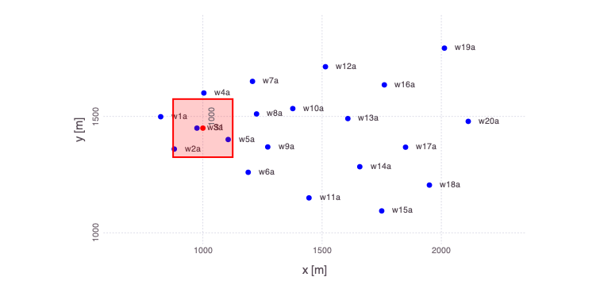
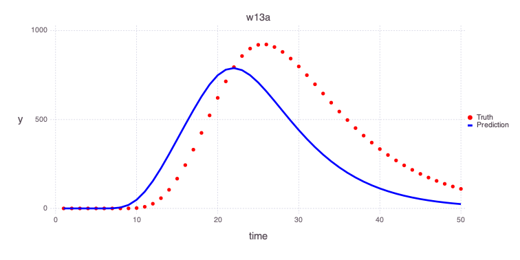
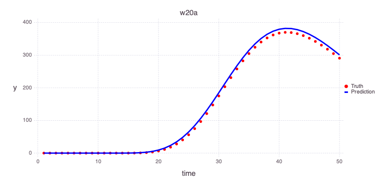

# Model Calibration for Contamination Problem

[MADS](http://madsjulia.github.io/Mads.jl) is applied to solve a general groundwater contamination problem using model inversion.

[MADS](http://madsjulia.github.io/Mads.jl) includes analytical solver called [Anasol.jl](http://madsjulia.github.io/Anasol.jl) to solve the groundwater contamination transport in a aquifer.

## Problem setup

```julia
import Mads
```

### Setup the working directory

```julia
cd(joinpath(Mads.dir, "examples", "contamination"))
```

### Load MADS input file

```julia
md = Mads.loadmadsfile("w01.mads")
```

    Dict{String, Any} with 7 entries:
      "Grid"         => Dict{Any, Any}("zmax"=>50, "time"=>50, "xcount"=>33, "zcoun…
      "Sources"      => Dict{Any, Any}[Dict("box"=>Dict{Any, Any}("dz"=>Dict{Any, A…
      "Parameters"   => OrderedCollections.OrderedDict{String, OrderedCollections.O…
      "Wells"        => OrderedCollections.OrderedDict{String, Any}("w1a"=>Dict{Any…
      "Time"         => Dict{Any, Any}("step"=>1, "start"=>1, "end"=>50)
      "Observations" => OrderedCollections.OrderedDict{Any, Any}("w1a_1"=>OrderedCo…
      "Filename"     => "w01.mads"

### Plot

Generate a plot of the loaded problem showing the well locations and the location of the contaminant source:

```julia
Mads.plotmadsproblem(md, keyword="all_wells")
```



There are 20 monitoring wells.

Each well has 2 measurement ports:
- shallow (3 m below the water table labeled `a`) and
- deep (33 m below the water table labeled `b`).

Contaminant concentrations are observed for 50 years at each well.

The contaminant transport is solved using the [`Anasol`](https://github.com/madsjulia/Anasol.jl) package in MADS.

### Unknown model parameters

* Start time of contaminant release $t_0$
* End time of contaminant release $t_1$
* Advective pore velocity $v$

### Reduced model setup

Analysis of the data from only 2 monitoring locations: `w13a` and `w20a`.

```julia
Mads.allwellsoff!(md) # turn off all wells
Mads.wellon!(md, "w13a") # use well w13a
Mads.wellon!(md, "w20a") # use well w20a
```

    OrderedCollections.OrderedDict{Any, Any} with 100 entries:
      "w13a_1"  => OrderedCollections.OrderedDict{Any, Any}("well"=>"w13a", "time"=…
      "w13a_2"  => OrderedCollections.OrderedDict{Any, Any}("well"=>"w13a", "time"=…
      "w13a_3"  => OrderedCollections.OrderedDict{Any, Any}("well"=>"w13a", "time"=…
      "w13a_4"  => OrderedCollections.OrderedDict{Any, Any}("well"=>"w13a", "time"=…
      "w13a_5"  => OrderedCollections.OrderedDict{Any, Any}("well"=>"w13a", "time"=…
      "w13a_6"  => OrderedCollections.OrderedDict{Any, Any}("well"=>"w13a", "time"=…
      "w13a_7"  => OrderedCollections.OrderedDict{Any, Any}("well"=>"w13a", "time"=…
      "w13a_8"  => OrderedCollections.OrderedDict{Any, Any}("well"=>"w13a", "time"=…
      "w13a_9"  => OrderedCollections.OrderedDict{Any, Any}("well"=>"w13a", "time"=…
      "w13a_10" => OrderedCollections.OrderedDict{Any, Any}("well"=>"w13a", "time"=…
      "w13a_11" => OrderedCollections.OrderedDict{Any, Any}("well"=>"w13a", "time"=…
      "w13a_12" => OrderedCollections.OrderedDict{Any, Any}("well"=>"w13a", "time"=…
      "w13a_13" => OrderedCollections.OrderedDict{Any, Any}("well"=>"w13a", "time"=…
      "w13a_14" => OrderedCollections.OrderedDict{Any, Any}("well"=>"w13a", "time"=…
      "w13a_15" => OrderedCollections.OrderedDict{Any, Any}("well"=>"w13a", "time"=…
      "w13a_16" => OrderedCollections.OrderedDict{Any, Any}("well"=>"w13a", "time"=…
      "w13a_17" => OrderedCollections.OrderedDict{Any, Any}("well"=>"w13a", "time"=…
      "w13a_18" => OrderedCollections.OrderedDict{Any, Any}("well"=>"w13a", "time"=…
      "w13a_19" => OrderedCollections.OrderedDict{Any, Any}("well"=>"w13a", "time"=…
      "w13a_20" => OrderedCollections.OrderedDict{Any, Any}("well"=>"w13a", "time"=…
      "w13a_21" => OrderedCollections.OrderedDict{Any, Any}("well"=>"w13a", "time"=…
      "w13a_22" => OrderedCollections.OrderedDict{Any, Any}("well"=>"w13a", "time"=…
      "w13a_23" => OrderedCollections.OrderedDict{Any, Any}("well"=>"w13a", "time"=…
      "w13a_24" => OrderedCollections.OrderedDict{Any, Any}("well"=>"w13a", "time"=…
      "w13a_25" => OrderedCollections.OrderedDict{Any, Any}("well"=>"w13a", "time"=…
      â‹®         => â‹®

Generate a plot of the updated problem showing the 2 well locations applied in the analyses as well as the location of the contaminant source:

```julia
Mads.plotmadsproblem(md; keyword="w13a_w20a")
```


## Initial estimates

Plot initial estimates of the contamiant concentrations at the 2 monitoring wells based on the initial model parameters:

- `w13a`

```julia
Mads.plotmatches(md, "w13a"; display=true)
```



- `w20a`

```julia
Mads.plotmatches(md, "w20a"; display=true)
```


## Model calibration

Execute model calibration based on the concentrations observed in the two monitoring wells:

```julia
calib_param, calib_results = Mads.calibrate(md)
```

Compute forward model predictions based on the calibrated model parameters:

```julia
calib_predictions = Mads.forward(md, calib_param)
```

    OrderedCollections.OrderedDict{Any, Float64} with 100 entries:
      "w13a_1"  => 0.0
      "w13a_2"  => 0.0
      "w13a_3"  => 0.0
      "w13a_4"  => 0.0
      "w13a_5"  => 0.0
      "w13a_6"  => 4.79956e-11
      "w13a_7"  => 0.000284228
      "w13a_8"  => 0.0590933
      "w13a_9"  => 0.92868
      "w13a_10" => 5.08796
      "w13a_11" => 16.2469
      "w13a_12" => 37.7882
      "w13a_13" => 71.6886
      "w13a_14" => 118.275
      "w13a_15" => 176.509
      "w13a_16" => 244.465
      "w13a_17" => 319.785
      "w13a_18" => 400.036
      "w13a_19" => 482.934
      "w13a_20" => 566.28
      "w13a_21" => 647.03
      "w13a_22" => 720.732
      "w13a_23" => 782.658
      "w13a_24" => 829.249
      "w13a_25" => 858.781
      â‹®         => â‹®

Plot the predicted estimates of the contamiant concentrations at the 2 monitoring wells based on the estimated model parameters based on the performed model calibration:

- `w13a`

```julia
Mads.plotmatches(md, calib_predictions, "w13a")
```


- `w20a`

```julia
Mads.plotmatches(md, calib_predictions, "w20a")
```




Initial values of the optimized model parameters are:

```julia
Mads.showparameters(md)
```

    Pore x velocity [L/T] : vx       =              40 log-transformed min = 0.01 max = 200.0
    Start Time [T]        : source1_t0 =               4 min = 0.0 max = 10.0
    End Time [T]          : source1_t1 =              15 min = 5.0 max = 40.0
    Number of optimizable parameters: 3

Estimated values of the optimized model parameters are:

```julia
Mads.showparameterestimates(md, calib_param)
```

    3-element Vector{Pair{String, Float64}}:
             "vx" => 31.059669248076222
     "source1_t0" => 5.036614115598699
     "source1_t1" => 16.62089724181972