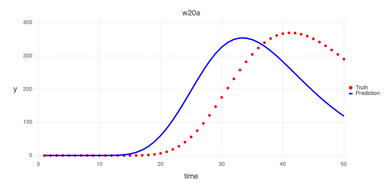

# Mads Notebook: Example Contamination Problem

## Problem setup

Import Mads


```julia
import Mads
```

    ┌ Info: Precompiling Mads [d6bdc55b-bd94-5012-933c-1f73fc2ee992]
    └ @ Base loading.jl:1317


    Mads: Model Analysis & Decision Support
    ====
    
        ___      ____            ____    ____              ______
       /   \    /    \          /    |  |    \            /  __  \
      |     \  /     |         /     |  |     \          /  /  \__\
      |  |\  \/  /|  |        /      |  |      \        |  |
      |  | \    / |  |       /  /|   |  |   |\  \        \  \______.
      |  |  \__/  |  |      /  / |   |  |   | \  \        \_______  \
      |  |        |  |     /  /  |   |  |   |  \  \               \  \
      |  |        |  |    /  /===|   |  |   |___\  \    __.        |  |
      |  |        |  |   /  /    |   |  |           \   \  \______/  /
      |__|        |__|  /__/     |___|  |____________\   \__________/
    
    MADS is an integrated high-performance computational framework for data- and model-based analyses.
    MADS can perform: Sensitivity Analysis, Parameter Estimation, Model Inversion and Calibration, Uncertainty Quantification, Model Selection and Model Averaging, Model Reduction and Surrogate Modeling, Machine Learning, Decision Analysis and Support.


    WARNING: Method definition getparamsmin(Base.AbstractDict{K, V} where V where K) in module Mads at /Users/vvv/.julia/dev/Mads/src/MadsParameters.jl:148 overwritten at /Users/vvv/.julia/dev/Mads/src/MadsParameters.jl:170.
      ** incremental compilation may be fatally broken for this module **
    
        Updating registry at `~/.julia/registries/General`
    ┌ Warning: could not download https://pkg.julialang.org/registries
    └ @ Pkg.Types /Users/julia/buildbot/worker/package_macos64/build/usr/share/julia/stdlib/v1.6/Pkg/src/Types.jl:980
       Resolving package versions...
    [ Info: Module BIGUQ is not available!
    ┌ Info: Installing pyqt package to avoid buggy tkagg backend.
    └ @ PyPlot /Users/vvv/.julia/packages/PyPlot/XHEG0/src/init.jl:118


Change the working directory


```julia
cd(joinpath(Mads.madsdir, "examples", "contamination"))
```

Load Mads input file


```julia
md = Mads.loadmadsfile("w01.mads")
```


    Dict{String, Any} with 7 entries:
      "Grid"         => Dict{Any, Any}("zmax"=>50, "time"=>50, "xcount"=>33, "zcoun…
      "Sources"      => Dict{Any, Any}[Dict("box"=>Dict{Any, Any}("dz"=>Dict{Any, A…
      "Parameters"   => OrderedCollections.OrderedDict{String, OrderedCollections.O…
      "Wells"        => OrderedCollections.OrderedDict{String, Any}("w1a"=>Dict{Any…
      "Time"         => Dict{Any, Any}("step"=>1, "start"=>1, "end"=>50)
      "Observations" => OrderedCollections.OrderedDict{Any, Any}("w1a_1"=>OrderedCo…
      "Filename"     => "w01.mads"


Generate a plot of the loaded problem showing the well locations and the location of the contaminant source:


```julia
Mads.plotmadsproblem(md, keyword="all_wells")
```


    

    


    

There are 20 monitoring wells.
Each well has 2 measurement ports: shallow (3 m below the water table labeled `a`) and deep (33 m below the water table labeled `b`).
Contaminant concentrations are observed for 50 years at each well.
The contaminant transport is solved using the `Anasol` package in Mads.

### Unknown model parameters

* Start time of contaminant release $t_0$
* End time of contaminant release $t_1$
* Advective pore velocity $v$

### Reduced model setup 

Analysis of the data from only 2 monitoring locations: `w13a` and `w20a`.


```julia
Mads.allwellsoff!(md) # turn off all wells
Mads.wellon!(md, "w13a") # use well w13a
Mads.wellon!(md, "w20a") # use well w20a
```


    OrderedCollections.OrderedDict{Any, Any} with 100 entries:
      "w13a_1"  => OrderedCollections.OrderedDict{Any, Any}("well"=>"w13a", "time"=…
      "w13a_2"  => OrderedCollections.OrderedDict{Any, Any}("well"=>"w13a", "time"=…
      "w13a_3"  => OrderedCollections.OrderedDict{Any, Any}("well"=>"w13a", "time"=…
      "w13a_4"  => OrderedCollections.OrderedDict{Any, Any}("well"=>"w13a", "time"=…
      "w13a_5"  => OrderedCollections.OrderedDict{Any, Any}("well"=>"w13a", "time"=…
      "w13a_6"  => OrderedCollections.OrderedDict{Any, Any}("well"=>"w13a", "time"=…
      "w13a_7"  => OrderedCollections.OrderedDict{Any, Any}("well"=>"w13a", "time"=…
      "w13a_8"  => OrderedCollections.OrderedDict{Any, Any}("well"=>"w13a", "time"=…
      "w13a_9"  => OrderedCollections.OrderedDict{Any, Any}("well"=>"w13a", "time"=…
      "w13a_10" => OrderedCollections.OrderedDict{Any, Any}("well"=>"w13a", "time"=…
      "w13a_11" => OrderedCollections.OrderedDict{Any, Any}("well"=>"w13a", "time"=…
      "w13a_12" => OrderedCollections.OrderedDict{Any, Any}("well"=>"w13a", "time"=…
      "w13a_13" => OrderedCollections.OrderedDict{Any, Any}("well"=>"w13a", "time"=…
      "w13a_14" => OrderedCollections.OrderedDict{Any, Any}("well"=>"w13a", "time"=…
      "w13a_15" => OrderedCollections.OrderedDict{Any, Any}("well"=>"w13a", "time"=…
      "w13a_16" => OrderedCollections.OrderedDict{Any, Any}("well"=>"w13a", "time"=…
      "w13a_17" => OrderedCollections.OrderedDict{Any, Any}("well"=>"w13a", "time"=…
      "w13a_18" => OrderedCollections.OrderedDict{Any, Any}("well"=>"w13a", "time"=…
      "w13a_19" => OrderedCollections.OrderedDict{Any, Any}("well"=>"w13a", "time"=…
      "w13a_20" => OrderedCollections.OrderedDict{Any, Any}("well"=>"w13a", "time"=…
      "w13a_21" => OrderedCollections.OrderedDict{Any, Any}("well"=>"w13a", "time"=…
      "w13a_22" => OrderedCollections.OrderedDict{Any, Any}("well"=>"w13a", "time"=…
      "w13a_23" => OrderedCollections.OrderedDict{Any, Any}("well"=>"w13a", "time"=…
      "w13a_24" => OrderedCollections.OrderedDict{Any, Any}("well"=>"w13a", "time"=…
      "w13a_25" => OrderedCollections.OrderedDict{Any, Any}("well"=>"w13a", "time"=…
      ⋮         => ⋮


Generate a plot of the updated problem showing the 2 well locations applied in the analyses as well as the location of the contaminant source:


```julia
Mads.plotmadsproblem(md; keyword="w13a_w20a")
```


    

    


    

## Initial estimates

Plot initial estimates of the contamiant concentrations at the 2 monitoring wells based on the initial model parameters: 


```julia
Mads.plotmatches(md, "w13a"; display=true)
```


    

    


    


```julia
Mads.plotmatches(md, "w20a"; display=true)
```


    

    


    

## Model calibration

Execute model calibration based on the concentrations observed in the two monitoring wells:


```julia
calib_param, calib_results = Mads.calibrate(md)
```


    (OrderedCollections.OrderedDict("n" => 0.1, "rf" => 1.0, "lambda" => 0.0, "theta" => 0.0, "vx" => 31.059669248076222, "vy" => 0.0, "vz" => 0.0, "ax" => 70.0, "ay" => 15.0, "az" => 0.3…), OptimBase.MultivariateOptimizationResults{LsqFit.LevenbergMarquardt, Float64, 1}(LsqFit.LevenbergMarquardt(), [0.740931532960472, -0.20135792079033074, -0.44291104407363896], [0.6737086338839451, 0.007322888567510982, -0.34261232076929443], 41650.46179056277, 13, false, true, 0.0001, 0.0, false, 0.001, 0.0, false, 1.0e-6, 0.0, false, Iter     Function value   Gradient norm 
    ------   --------------   --------------
    , 170, 13, 0))


Compute forward model predictions based on the calibrated model parameters:


```julia
calib_predictions = Mads.forward(md, calib_param)
```


    OrderedCollections.OrderedDict{Any, Float64} with 100 entries:
      "w13a_1"  => 0.0
      "w13a_2"  => 0.0
      "w13a_3"  => 0.0
      "w13a_4"  => 0.0
      "w13a_5"  => 0.0
      "w13a_6"  => 4.79956e-11
      "w13a_7"  => 0.000284228
      "w13a_8"  => 0.0590933
      "w13a_9"  => 0.92868
      "w13a_10" => 5.08796
      "w13a_11" => 16.2469
      "w13a_12" => 37.7882
      "w13a_13" => 71.6886
      "w13a_14" => 118.275
      "w13a_15" => 176.509
      "w13a_16" => 244.465
      "w13a_17" => 319.785
      "w13a_18" => 400.036
      "w13a_19" => 482.934
      "w13a_20" => 566.28
      "w13a_21" => 647.03
      "w13a_22" => 720.732
      "w13a_23" => 782.658
      "w13a_24" => 829.249
      "w13a_25" => 858.781
      ⋮         => ⋮


Plot the predicted estimates of the contamiant concentrations at the 2 monitoring wells based on the estimated model parameters based on the performed model calibration: 


```julia
Mads.plotmatches(md, calib_predictions, "w13a")
```


    

    


    


```julia
Mads.plotmatches(md, calib_predictions, "w20a")
```


    

    


    

Initial values of the optimized model parameters are:


```julia
Mads.showparameters(md)
```

    Pore x velocity [L/T] : vx       =              40 log-transformed min = 0.01 max = 200.0 
    Start Time [T]        : source1_t0 =               4 min = 0.0 max = 10.0 
    End Time [T]          : source1_t1 =              15 min = 5.0 max = 40.0 
    Number of optimizable parameters: 3


Estimated values of the optimized model parameters are:


```julia
Mads.showparameterestimates(md, calib_param)
```


    3-element Vector{Pair{String, Float64}}:
             "vx" => 31.059669248076222
     "source1_t0" => 5.036614115598699
     "source1_t1" => 16.62089724181972


