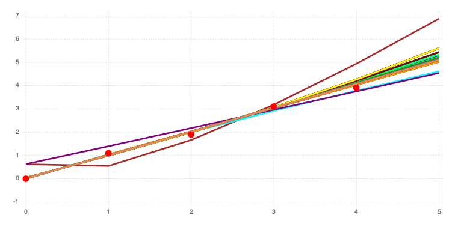
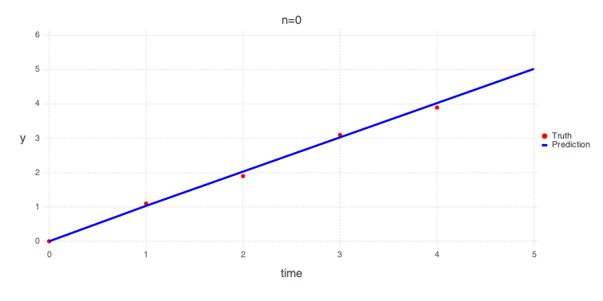
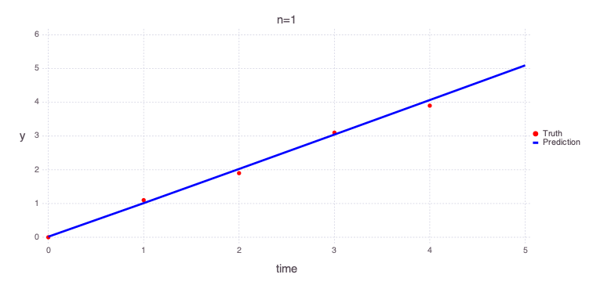

# Mads notebook: Model diagnostics

## Problem setup

Import Mads


```julia
Pkg.resolve()
import Revise
import Mads
```

Setup the working directory:


```julia
cd(joinpath(Mads.madsdir, "notebooks", "model_diagnostics"))
```

Create a problem dictionary:


```julia
md = Dict()
```


    Dict{Any, Any}()


Setup model parameters:


```julia
md["Parameters"] = Mads.createparameters([1,1,1,1]; key=["a", "b", "c", "n"], dist=["Uniform(-10, 10)", "Uniform(-10, 10)", "Uniform(-5, 5)", "Uniform(0, 3)"])
```


    OrderedCollections.OrderedDict{Any, Any} with 4 entries:
      "a" => OrderedCollections.OrderedDict{String, Any}("init"=>1, "type"=>"opt", …
      "b" => OrderedCollections.OrderedDict{String, Any}("init"=>1, "type"=>"opt", …
      "c" => OrderedCollections.OrderedDict{String, Any}("init"=>1, "type"=>"opt", …
      "n" => OrderedCollections.OrderedDict{String, Any}("init"=>1, "type"=>"opt", …


There are 4 model parameters (`a`, `b`, `c`, and `n`).
The initial values and the prior distributions (based on prior knowledge of the parameter uncertainty) are defined for each parameter.


```julia
md["Observations"] = Mads.createobservations([0,1.1,1.9,3.1,3.9,5]; weight=[100,100,100,100,10,0], time=[0,1,2,3,4,5], dist=["Uniform(0, 1)", "Uniform(0, 2)", "Uniform(1, 3)", "Uniform(2, 4)", "Uniform(3, 5)", "Uniform(4, 6)"])
```

    dist = ["Uniform(0, 1)", "Uniform(0, 2)", "Uniform(1, 3)", "Uniform(2, 4)", "Uniform(3, 5)", "Uniform(4, 6)"]


    OrderedCollections.OrderedDict{Any, Any} with 6 entries:
      "o1" => OrderedCollections.OrderedDict{String, Any}("target"=>0.0, "weight"=>…
      "o2" => OrderedCollections.OrderedDict{String, Any}("target"=>1.1, "weight"=>…
      "o3" => OrderedCollections.OrderedDict{String, Any}("target"=>1.9, "weight"=>…
      "o4" => OrderedCollections.OrderedDict{String, Any}("target"=>3.1, "weight"=>…
      "o5" => OrderedCollections.OrderedDict{String, Any}("target"=>3.9, "weight"=>…
      "o6" => OrderedCollections.OrderedDict{String, Any}("target"=>5.0, "weight"=>…


There are 6 observations (`o1`, `o2`, `o3`, ... and `o6`).
The calibration targets, observation weights (i.e., inverse of measurement standard deviations), and acceptable ranges are defined for each observation.

A function (called `polynominal`) is defined to compute the 6 observations given 4 model parameters as an input:


```julia
function polynominal(parameters::AbstractVector)
	f(t) = parameters[1] * (t ^ parameters[4]) + parameters[2] * t + parameters[3] # a * t^n + b * t + c
	predictions = map(f, 0:5)
	return predictions
end
```


    polynominal (generic function with 1 method)


The `polynominal` function is setup now in the `md` dictionary as a model that will be applied to perform the simulations:


```julia
Mads.setmodel!(md, polynominal)
```


    (::Mads.var"#madscommandfunctionwithexpressions#18") (generic function with 1 method)


Set a default name for MADS input / output files:


```julia
md["Filename"] = "model_diagnostics.mads"
```


    "model_diagnostics.mads"


Now, the problem dictionary `md` is fully defined:


```julia
display(md)
```


    Dict{Any, Any} with 4 entries:
      "Julia function" => polynominal
      "Parameters"     => OrderedCollections.OrderedDict{Any, Any}("a"=>OrderedColl…
      "Observations"   => OrderedCollections.OrderedDict{Any, Any}("o1"=>OrderedCol…
      "Filename"       => "model_diagnostics.mads"


And the model diagnostic problem is setup!

## Forward model simulation

A single forward model run based on the initial model parameter values can be executed as follows:


```julia
Mads.forward(md)
```


    OrderedCollections.OrderedDict{Any, Float64} with 6 entries:
      "o1" => 1.0
      "o2" => 3.0
      "o3" => 5.0
      "o4" => 7.0
      "o5" => 9.0
      "o6" => 11.0


The forward model run can be also executed using the following command:


```julia
polynominal(Mads.getparamsinit(md))
```


    6-element Vector{Float64}:
      1.0
      3.0
      5.0
      7.0
      9.0
     11.0


The runs above produce outputs representing model predictions at the six observations in time.

The forward simulations are based on the initial guesses for the model parameters.

The initial model predictions can be plotted as shown below:


```julia
Mads.plotmatches(md)
```


    

    


    

The figure above shows that the `true` observations are not well reproduced by the model using the initial model parameter guesses.

## Model calibration (inversion)

The calibation (inversion) of the developed model is achieved using the following command:


```julia
calib_param, calib_result = Mads.calibrate(md)
```


    (OrderedCollections.OrderedDict("a" => 0.48652749043975874, "b" => 0.48653799120462793, "c" => -0.001625793681175658, "n" => 1.0209744172380697), OptimBase.MultivariateOptimizationResults{LsqFit.LevenbergMarquardt, Float64, 1}(LsqFit.LevenbergMarquardt(), [0.10016742116155988, 0.10016742116155988, 0.20135792079033074, 0.33983690945412187], [0.04867196375755519, 0.04867301507909251, -0.00032515874196489825, 0.3472623008114141], 420.3001214282925, 5, false, true, 0.0001, 0.0, false, 0.001, 0.0, false, 1.0e-6, 0.0, false, Iter     Function value   Gradient norm 
    ------   --------------   --------------
    , 71, 5, 0))


```julia
Mads.plotmatches(md, calib_param)
```


    

    


    

Initial values of the model parameters are:


```julia
Mads.showparameterestimates(md)
```

    a =               1 distribution = Uniform(-10, 10) 
    b =               1 distribution = Uniform(-10, 10) 
    c =               1 distribution = Uniform(-5, 5) 
    n =               1 distribution = Uniform(0, 3) 
    Number of optimizable parameters: 4


Estimated values of the model parameters based on the model calibration (inversion) are:


```julia
Mads.showparameterestimates(md, calib_param)
```

    a =        0.486527 distribution = Uniform(-10, 10) 
    b =        0.486538 distribution = Uniform(-10, 10) 
    c =     -0.00162579 distribution = Uniform(-5, 5) 
    n =         1.02097 distribution = Uniform(0, 3) 
    Number of optimizable parameters: 4


The model inversion can be also performed for a set of random initial guesses for model parameters.


```julia
calib_random_results = Mads.calibraterandom(md, 100; seed=2021, all=true)
```


    100×3 Matrix{Any}:
      232.272  …  OrderedCollections.OrderedDict("a"=>0.00653517, "b"=>0.950689, "c"=>0.039249, "n"=>3.0)
      270.314     OrderedCollections.OrderedDict("a"=>-0.28542, "b"=>1.27948, "c"=>0.0178456, "n"=>0.951994)
      232.272     OrderedCollections.OrderedDict("a"=>0.00653398, "b"=>0.950704, "c"=>0.0392286, "n"=>3.0)
      232.272     OrderedCollections.OrderedDict("a"=>0.00653436, "b"=>0.950702, "c"=>0.0392321, "n"=>2.99998)
      232.272     OrderedCollections.OrderedDict("a"=>0.00653522, "b"=>0.950689, "c"=>0.039249, "n"=>3.0)
      270.097  …  OrderedCollections.OrderedDict("a"=>-4.30065, "b"=>5.28695, "c"=>0.0214167, "n"=>0.995285)
     7643.02      OrderedCollections.OrderedDict("a"=>-9.89624, "b"=>9.82224, "c"=>0.622939, "n"=>0.910639)
      269.91      OrderedCollections.OrderedDict("a"=>-4.41759, "b"=>5.40692, "c"=>0.0206894, "n"=>0.9961)
      270.093     OrderedCollections.OrderedDict("a"=>-4.82082, "b"=>5.80708, "c"=>0.0214349, "n"=>0.995788)
      270.067     OrderedCollections.OrderedDict("a"=>-2.58655, "b"=>3.57364, "c"=>0.0211371, "n"=>0.992455)
      269.929  …  OrderedCollections.OrderedDict("a"=>-3.36971, "b"=>4.3589, "c"=>0.0207631, "n"=>0.994848)
      268.409     OrderedCollections.OrderedDict("a"=>0.0354613, "b"=>0.998702, "c"=>1.70238e-5, "n"=>0.000376271)
      268.41      OrderedCollections.OrderedDict("a"=>0.0354481, "b"=>0.998704, "c"=>2.21817e-5, "n"=>0.000448126)
        ⋮      ⋱  
      232.272     OrderedCollections.OrderedDict("a"=>0.00653517, "b"=>0.950689, "c"=>0.039249, "n"=>3.0)
      232.272     OrderedCollections.OrderedDict("a"=>0.00653522, "b"=>0.950689, "c"=>0.039249, "n"=>3.0)
      232.272  …  OrderedCollections.OrderedDict("a"=>0.00653436, "b"=>0.950702, "c"=>0.0392321, "n"=>2.99998)
      270.091     OrderedCollections.OrderedDict("a"=>-5.97129, "b"=>6.95745, "c"=>0.0214664, "n"=>0.996586)
      270.122     OrderedCollections.OrderedDict("a"=>-2.481, "b"=>3.46755, "c"=>0.0212952, "n"=>0.991901)
      269.794     OrderedCollections.OrderedDict("a"=>3.95245, "b"=>-2.96176, "c"=>0.0197838, "n"=>1.00408)
      232.272     OrderedCollections.OrderedDict("a"=>0.00653517, "b"=>0.950689, "c"=>0.039249, "n"=>3.0)
      232.272  …  OrderedCollections.OrderedDict("a"=>0.00653516, "b"=>0.950689, "c"=>0.0392491, "n"=>3.0)
      270.802     OrderedCollections.OrderedDict("a"=>-0.121823, "b"=>1.11748, "c"=>0.0170054, "n"=>0.896066)
      269.868     OrderedCollections.OrderedDict("a"=>0.962624, "b"=>0.0219806, "c"=>0.0223074, "n"=>1.02225)
      270.09      OrderedCollections.OrderedDict("a"=>-5.46149, "b"=>6.44768, "c"=>0.0214512, "n"=>0.996277)
      270.362     OrderedCollections.OrderedDict("a"=>-0.387051, "b"=>1.37691, "c"=>0.0197667, "n"=>0.954846)


The final parameter estimates from the 100 random-initial-guess inverse runs are collected into a matrix below:


```julia
calib_random_estimates = hcat(map(i->collect(values(calib_random_results[i,3])), 1:100)...)
```


    4×100 Matrix{Float64}:
     0.00653517  -0.28542    0.00653398  …  0.962624   -5.46149    -0.387051
     0.950689     1.27948    0.950704       0.0219806   6.44768     1.37691
     0.039249     0.0178456  0.0392286      0.0223074   0.0214512   0.0197667
     3.0          0.951994   3.0            1.02225     0.996277    0.954846


Plot the final predictions of the 100 random-initial-guess inverse runs:


```julia
forward_predictions = Mads.forward(md, calib_random_estimates)
Mads.spaghettiplot(md, forward_predictions)
```


    

    


    

The figure above demonstrates that there are several different global minima.

There are three important groups of results with different `n` values:
* `n` = 0
* `n` = 1
* `n` = 3 (upper prior bound)

The code below identifies and plots solutions associated with these 3 distinct groups:


```julia
ind_n0 = abs.(calib_random_estimates[4,:]) .< 0.1
in0 = findall(ind_n0 .== true)[1]
ind_n1 = abs.(calib_random_estimates[4,:] .- 1) .< 0.1
in1 = findall(ind_n1 .== true)[1]
ind_n3 = .!(ind_n0 .| ind_n1)
in3 = findall(ind_n3 .== true)[1]
pinit = Dict(zip(Mads.getparamkeys(md), Mads.getparamsinit(md)))
optnames = ["n=0", "n=1", "n=3"]
v = [in0, in1, in3]

for i = 1:3
	println("Solution for $(optnames[i])")
	Mads.showparameters(md, calib_random_results[v[i],3])
	Mads.plotmatches(md, calib_random_results[v[i],3]; title=optnames[i])
end
```


    

    


    Solution for n=0
    a =       0.0354613 distribution = Uniform(-10, 10) 
    b =        0.998702 distribution = Uniform(-10, 10) 
    c =     1.70238e-05 distribution = Uniform(-5, 5) 
    n =     0.000376271 distribution = Uniform(0, 3) 
    Number of optimizable parameters: 4


    

    


    Solution for n=1
    a =        -0.28542 distribution = Uniform(-10, 10) 
    b =         1.27948 distribution = Uniform(-10, 10) 
    c =       0.0178456 distribution = Uniform(-5, 5) 
    n =        0.951994 distribution = Uniform(0, 3) 
    Number of optimizable parameters: 4


    

    


    Solution for n=3
    a =      0.00653517 distribution = Uniform(-10, 10) 
    b =        0.950689 distribution = Uniform(-10, 10) 
    c =        0.039249 distribution = Uniform(-5, 5) 
    n =               3 distribution = Uniform(0, 3) 
    Number of optimizable parameters: 4


## Evaluation of predictive sensitivities and uncertainties

### Local sensitivity and uncertainty quantification


```julia
localsa = Mads.localsa(md; filename="model_diagnostics.png", par=collect(values(calib_param)))
```


    Dict{String, Any} with 6 entries:
      "of"          => 420.3
      "jacobian"    => [0.0 0.0 499.175 0.0; 994.721 994.721 499.175 0.0; … ; 409.6…
      "covar"       => [0.525233 -0.525787 0.000235488 -0.0662933; -0.525787 0.5263…
      "eigenmatrix" => [0.702251 0.102386 0.0288238 0.703939; 0.688973 0.0768143 0.…
      "eigenvalues" => [3.38862e-8, 2.743e-6, 3.91435e-5, 1.05994]
      "stddev"      => [0.72473, 0.725495, 0.00200318, 0.0916738]


`localsa["stddev"]` defines the estimated posterior uncertainties in the estimated model parameters.
This estimate is based on the Jacobian / Hessian matrix estimates of the parameter space curvature in the area of the estimated (inverted) optimal parameters.
The uncertainties are assumed to be Gaussian with standard deviations defined by `localsa["stddev"]`.


```julia
[Mads.getparamlabels(md) localsa["stddev"]]
```


    4×2 Matrix{Any}:
     "a"  0.72473
     "b"  0.725495
     "c"  0.00200318
     "n"  0.0916738


Based on these results, `c` is well constrained. `n` is also well defined. `a` and `b` are the most uncertain.

However, because of the local nature of the estimates these results are not very accurate and differ with the global  sensitivity and uncertainty analyses presented below.

The plots below show a series of graphical representations of the `localsa` results. 
These plots are generated automatically by the code.

A plot of the Jacobian repesenting the relationships between model parameters and estimated observations:


```julia
Mads.display("model_diagnostics-jacobian.png")
```


    

    


    


A plot of the eigen matrix of the Hessian (the Hessian is approximately computed based on the Jacobian above):


```julia
Mads.display("model_diagnostics-eigenmatrix.png")
```


    

    


    


A plot of the eigen values of the Hessian:


```julia
Mads.display("model_diagnostics-eigenvalues.png")
```


    

    


    


The eigen analysis presetned above suggest that `a` and `b` are correlated (this is expected based on the mathematical form of the solved model in the function `polynominal`).
Both parameters are represented by the first and last (4th) eigen vectors.

The parameters `n` and `c` are uncorrelated and also independent of `a` and `b`.

## Global sensitivity and uncertainty quantification

### Affine Invariant MCMC

Our module `AffineInvariantMCMC.jl` (aka `EMCEE`) is applied to perform global sensitivity and uncertainty quantification:


```julia
chain, llhoods = Mads.emceesampling(md; numwalkers=10, nsteps=100000, burnin=10000, thinning=10, seed=2016, sigma=0.01)
```


    ([-2.9318734488241254 -2.2115004894325656 … 0.59046225841824 -0.1317764013305327; 3.9213382339060123 3.2754768843563364 … 0.4001283063148645 1.0610138945109913; 0.025000166709641274 -0.07072908085654725 … 0.062343770966873546 0.07827331041888207; 0.9914349083311713 1.0146213546858134 … 1.009450999917408 0.20217807527536452], [-13.350385897100534, -13.83572977185207, -14.62374978746418, -13.542296325761239, -13.743265533105149, -13.371356376807029, -15.437727968793991, -13.923819788102527, -14.03616530179732, -17.012966126679196  …  -14.999244279386676, -14.832192904405328, -14.205686001261679, -13.51735973205491, -13.177385309063698, -13.374322254910798, -15.70916729088129, -13.311448472159798, -13.452308243225435, -14.380811745476537])


The obtained set of 10000 equally likely parameter combinations capturing the global sensitivity and uncertainty of the model parameters and associated predictions are plotted below.


```julia
f = Mads.forward(md, chain)
```


    6×10000 Matrix{Float64}:
     0.0250002  -0.0707291  0.0462104  …  0.0135752  0.0623438  0.0782733
     1.01446     0.993247   0.931065      1.00549    1.05293    1.00751
     2.03864     2.01217    1.9508        1.99482    2.05129    2.0487
     3.07577     3.01377    3.00617       2.98318    3.0526     3.09676
     4.12129     4.00404    4.08221       3.97092    4.05585    4.14792
     5.17302     4.98586    5.17251    …  4.9582     5.06055    5.20089


```julia
Mads.spaghettiplot(md, f)
```


    

    


    

The figure above compares the 10000 model predictions with the actual measurements (red dots).

The figure below shows the histograms of the posterior model uncertainties (along the diagonal) and the cross-plots between the parameters (off-diagonal plots; the cross-plots above and below the diagonal are similar):


```julia
Mads.scatterplotsamples(md, permutedims(chain), "model_diagnostics-emcee_scatter.png")
```


```julia
Mads.display("model_diagnostics-emcee_scatter.png")
```


    

    


    


The figure above shows that the optimal (most probable) estimates are:
* `a` = 0
* `b` = 1
* `c` = 0
* `n` = 0

`c` i the most constrained (varing between -0.2 and 0.2).

There are plausible solutions for any value of `a`, `b` and `n` within the prior uncertainty range.

The parameters `a` and `b` strongly inversely correlated by their respective cross-plots.

Based on the cross-plots, the plausible values for `n` can be within the entire prior uncertainty range if (1) `a` is equal to 0 and (2) `b` is equal to 1.

The plausible values for `n` are close to 1 if (1) `a` is very different from 0 and (2) `b` is very different from 1.


### Saltelli (Sobol) amd EFAST global sensitivity analyses

Both Saltelli (Sobol) amd EFAST methods are producting similar results.
Both methods are designed to perform global sensitivity analyses.
EFAST is computationally more efficient.

The Saltelli (Sobol) results are obtained as follows:


```julia
saltelli_results = Mads.saltelli(md, N=10000, seed=2016)
```


    Dict{String, Any} with 6 entries:
      "method"     => "saltelli"
      "samplesize" => 10000
      "mes"        => OrderedCollections.OrderedDict("o1"=>OrderedCollections.Order…
      "tes"        => OrderedCollections.OrderedDict("o1"=>OrderedCollections.Order…
      "seed"       => 2016
      "var"        => OrderedCollections.OrderedDict("o1"=>OrderedCollections.Order…


```julia
Mads.plotobsSAresults(md, saltelli_results)
```


    

    


    

    


    

    


    


    

    


    

The EFAST results are obtained as follows:


```julia
efastresult = Mads.efast(md, N=1000, seed=2016)
Mads.plotobsSAresults(md, efastresult, filename="sensitivity_efast.png", xtitle = "Time [-]", ytitle = "Observation [-]")
```


    

    


    

    


    

    


    


    

    


    

The difference in the `total` and `main` effect plots suggest correlations in the model parameters (which is also demonstrated by the `AffineInvariantMCMC` analyses above).

The figures also demonstrate that the parameter sensitivity to observations change over time.

Based on the `total effect`, parameter `a` and `n` sensitivities genereally increases with time.
Parameter `b` and `b` sensitivities genereally decreases with time.

## Decision Analysis using Information-Gap Decision Theory

Define the Information-Gap Decision Theory horizons of uncertainty `h`:


```julia
h = [0.001, 0.01, 0.02, 0.05, 0.1, 0.2, 0.5, 1]


```


    8-element Vector{Float64}:
     0.001
     0.01
     0.02
     0.05
     0.1
     0.2
     0.5
     1.0


Define the polynominal models to be explored:


```julia
models = ["y = a * t + c", "y = a * t^(1.1) + b * t + c", "y = a * t^n + b * t + c", "y = a * exp(t * n) + b * t + c"]
```


    4-element Vector{String}:
     "y = a * t + c"
     "y = a * t^(1.1) + b * t + c"
     "y = a * t^n + b * t + c"
     "y = a * exp(t * n) + b * t + c"


Execute the infogap analyses, collect the obtained results, and produce a figure summarizing the results:


```julia
import Gadfly
import Colors
lmin = Vector{Any}(undef, 4)
lmax = Vector{Any}(undef, 4)
colors = ["blue", "red", "green", "orange"]
for i = 1:4
	min, max = Mads.infogap_jump_polynomial(model=i, plot=true, horizons=h, retries=10, maxiter=1000, verbosity=0, seed=2015)
	lmin[i] = Gadfly.layer(x=min, y=h, Gadfly.Geom.line, Gadfly.Theme(default_color=Base.parse(Colors.Colorant, colors[i])))
	lmax[i] = Gadfly.layer(x=max, y=h, Gadfly.Geom.line, Gadfly.Theme(default_color=Base.parse(Colors.Colorant, colors[i])))
end
f = Gadfly.plot(lmin..., lmax..., Gadfly.Guide.xlabel("o5"), Gadfly.Guide.ylabel("Horizon of uncertainty"), Gadfly.Guide.title("Opportuneness vs. Robustness"), Gadfly.Theme(highlight_width=0Gadfly.pt), Gadfly.Guide.manual_color_key("Models", models, colors))
Gadfly.draw(Gadfly.PNG("infogap_opportuneness_vs_robustness.png", 6Gadfly.inch, 4Gadfly.inch), f)
```

    ┌ Info: New seed: 2015
    └ @ Mads /Users/vvv/.julia/dev/Mads/src/MadsHelpers.jl:462


    Min h = 0.001 OF = 4.998333281688344 par = [0.9993333197989149, 0.0016666826937701167]
    Max h = 0.001 OF = 5.00166671833499 par = [1.0006666802044195, -0.001666682687108125]
    Min h = 0.01 OF = 4.983333280036714 par = [0.9933333177282005, 0.016666691395710947]
    Max h = 0.01 OF = 5.016666718990943 par = [1.0066666807443947, -0.016666684731030848]
    Min h = 0.02 OF = 4.966666614342419 par = [0.9866666521256426, 0.033333353714205226]
    Max h = 0.02 OF = 5.033333387019943 par = [1.0133333489146892, -0.03333335755350352]
    Min h = 0.05 OF = 4.916666615311706 par = [0.9666666528982734, 0.08333335082033852]
    Max h = 0.05 OF = 5.08333338580072 par = [1.0333333472115793, -0.08333335025717689]
    Min h = 0.1 OF = 4.833333282661476 par = [0.9333333197717608, 0.16666668380267258]
    Max h = 0.1 OF = 5.166666719675405 par = [1.0666666805654965, -0.16666668315207778]
    Min h = 0.2 OF = 4.666666617013978 par = [0.8666666531305123, 0.333333351361417]
    Max h = 0.2 OF = 5.3333333876552285 par = [1.133333347539164, -0.3333333500405913]
    Min h = 0.5 OF = 4.166666620015298 par = [0.666666653134728, 0.8333333543416581]
    Max h = 0.5 OF = 5.8333333916516725 par = [1.3333333485322296, -0.8333333510094758]
    Min h = 1.0 OF = 3.333333291678896 par = [0.33333331979902153, 1.666666692683788]
    Max h = 1.0 OF = 6.66666673165455 par = [1.6666666835343882, -1.666666686017392]


    ┌ Info: New seed: 2015
    └ @ Mads /Users/vvv/.julia/dev/Mads/src/MadsHelpers.jl:462


    Min h = 0.001 OF = 4.9960744454905965 par = [-0.03655198917957378, 1.0437989392240055, -0.008246956140052745]
    Max h = 0.001 OF = 5.003925554522909 par = [0.036551989057392965, 0.9562010609257169, 0.008246956122525443]
    Min h = 0.01 OF = 4.960745363330646 par = [-0.36551410869632334, 1.437982560318741, -0.08246845805988594]
    Max h = 0.01 OF = 5.039254636799261 par = [0.3655141073877924, 0.5620174412841543, 0.08246845786044212]
    Min h = 0.02 OF = 4.921490828175631 par = [-0.731027566617381, 1.8759643517308704, -0.16493679213714782]
    Max h = 0.02 OF = 5.078509171873495 par = [0.7310275550438009, 0.12403566252037508, 0.1649367889027792]
    Min h = 0.05 OF = 4.803727222947509 par = [-1.8275679184585027, 3.1899096986947266, -0.41234178651963727]
    Max h = 0.05 OF = 5.196272777724391 par = [1.8275679123567241, -1.189909691219638, 0.41234178565241686]
    Min h = 0.1 OF = 4.607454547104612 par = [-3.6551351873746936, 5.379818629776438, -0.8246834485881221]
    Max h = 0.1 OF = 5.392545454245484 par = [3.655135175083979, -3.3798186147139266, 0.824683446810193]
    Min h = 0.2 OF = 4.214909194737556 par = [-7.310269737140044, 9.759636506472651, -1.64936677598685]
    Max h = 0.2 OF = 5.7850908074455605 par = [7.3102697046759735, -7.759636466764177, 1.6493667702921515]
    Min h = 0.5 OF = 3.591684039656965 par = [-7.751158513274632, 10.000000041783382, -0.8850280664081923]
    Max h = 0.5 OF = 6.49427721194079 par = [9.382981348214942, -10.000000044037646, 1.3871392608548654]
    Min h = 1.0 OF = 2.6876583975888058 par = [-8.067223019985045, 10.000000062883482, 0.0672229701222594]
    Max h = 1.0 OF = 7.44592953417183 par = [9.736303636511739, -10.000000065441785, 0.26369642586347747]


    ┌ Info: New seed: 2015
    └ @ Mads /Users/vvv/.julia/dev/Mads/src/MadsHelpers.jl:462


    Min h = 0.001 OF = 4.993999809993968 par = [-0.0001250040451789784, 1.0026250655869564, -0.0035000665302511625, 2.999997843315674]
    Max h = 0.001 OF = 5.006000200041004 par = [0.00012500374313672267, 0.997374931285495, 0.0035000749793720805, 3.000000029507715]
    Min h = 0.01 OF = 4.939999809729828 par = [-0.0012500039848518721, 1.0262500653481148, -0.03500006635146049, 2.999999811324717]
    Max h = 0.01 OF = 5.060000190420172 par = [0.0012500039827685484, 0.9737499347289683, 0.035000066376460574, 2.9999998113247166]
    Min h = 0.02 OF = 4.879999809436044 par = [-0.002500003917827296, 1.0525000650829668, -0.07000006615333457, 2.9999999206621957]
    Max h = 0.02 OF = 5.120000190863952 par = [0.002500003913660588, 0.9474999350712004, 0.0700000662033339, 2.9999999206621952]
    Min h = 0.05 OF = 4.699999809110879 par = [-0.006250003705588852, 1.1312500640011731, -0.17500006484468256, 2.9999999863618134]
    Max h = 0.05 OF = 5.300000191636143 par = [0.006250003695269465, 0.8687499363840293, 0.1750000649694136, 2.99999998635084]
    Min h = 0.1 OF = 4.399999807272094 par = [-0.012500003374736784, 1.2625000628015948, -0.35000006419023805, 3.000000008232852]
    Max h = 0.1 OF = 5.600000194228184 par = [0.012500003353865882, 0.7374999379699614, 0.35000006443880427, 3.0000000082339633]
    Min h = 0.2 OF = 3.7999998042537553 par = [-0.025000002708412933, 1.5250000602396283, -0.700000062415874, 3.000000019082813]
    Max h = 0.2 OF = 6.20000019874704 par = [0.02500000266667985, 0.47499994130280493, 0.7000000629146885, 3.0000000190840956]
    Min h = 0.5 OF = 1.999999795385952 par = [-0.06250000069969568, 2.3125000523306776, -1.7500000565793346, 3.000000025626925]
    Max h = 0.5 OF = 8.000000212115324 par = [0.0625000005955181, -0.31250004847656593, 1.7500000578296342, 3.0000000256271333]
    Min h = 1.0 OF = -1.0000002193334967 par = [-0.12499999734956149, 3.625000039098136, -3.5000000467297627, 3.000000027811915]
    Max h = 1.0 OF = 11.000000234333372 par = [0.12499999714118018, -1.6250000313891586, 3.5000000492286207, 3.000000027812066]


    ┌ Info: New seed: 2015
    └ @ Mads /Users/vvv/.julia/dev/Mads/src/MadsHelpers.jl:462


    Min h = 0.001 OF = 4.93820509022155 par = [-1.991956463987334e-8, 1.001080524737567, -0.0020801343866858023, 2.9999999883894968]
    Max h = 0.001 OF = 5.061794919720368 par = [1.991956366528757e-8, 0.9989194750922847, 0.002080134822476713, 3.000000029984543]
    Min h = 0.01 OF = 4.382067676125225 par = [-1.9919025980225499e-7, 1.0108050472181263, -0.020801056118970217, 3.0000000258388377]
    Max h = 0.01 OF = 5.617932323094888 par = [1.991902594702715e-7, 0.9891949528332155, 0.020801056167635203, 3.0000000258388377]
    Min h = 0.02 OF = 3.7641372160181787 par = [-3.9837992109379617e-7, 1.0216100721965256, -0.0416020802659529, 3.0000000279194157]
    Max h = 0.02 OF = 6.23586278242203 par = [3.983799204298235e-7, 0.9783899279061579, 0.041602080363282834, 3.0000000279194157]
    Min h = 0.05 OF = 1.9103458356971257 par = [-9.959489049683935e-7, 1.0540251471317235, -0.10400515270690125, 3.0000000291677655]
    Max h = 0.05 OF = 8.089654160403452 par = [9.959489033084791e-7, 0.945974853124985, 0.1040051529502259, 3.0000000291677655]
    Min h = 0.1 OF = -1.1793064329087564 par = [-1.9918972144258892e-6, 1.1080502714651672, -0.20801027206863687, 3.000000028258382]
    Max h = 0.1 OF = 11.179306457039136 par = [1.9918972081062344e-6, 0.8919497284896971, 0.2080102739284642, 3.0000000295838825]
    Min h = 0.2 OF = -7.358611065908197 par = [-3.983793824341401e-6, 1.2161005218077126, -0.41602051491164094, 3.000000029791941]
    Max h = 0.2 OF = 17.35861105031053 par = [3.98379381770175e-6, 0.7838994792191215, 0.41602051588494027, 3.000000029791941]
    Min h = 0.5 OF = -25.896488521674833 par = [-9.959487073347952e-6, 1.5402506350898875, -1.0400496755102369, 2.999999728223722]
    Max h = 0.5 OF = 35.896523990350396 par = [9.959483725387019e-6, 0.4597487460979546, 1.040051205638272, 3.000000022944347]
    Min h = 1.0 OF = -56.79304787447036 par = [-1.9918966727663864e-5, 2.0805025200796528, -2.0801024466702493, 3.0000000299583918]
    Max h = 1.0 OF = 66.79304780650143 par = [1.9918966693524435e-5, -0.08050251512076644, 2.080102451967674, 3.0000000299999843]


```julia
Mads.display("infogap_opportuneness_vs_robustness.png")
```


    

    


    

